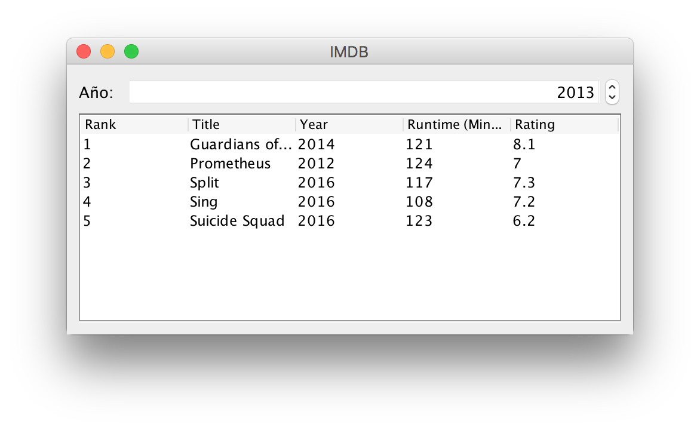

# IMDB

Crea una aplicación con interfaz de usuario como el de la imagen:

Permitirá seleccionar un año concreo usando un JSpinner y mostrará en un JTable la información de las 10 mejores películas de ese año según [IMDB](https://www.imdb.com).

La información necesaria está disponible en este [_dataset_](IMDB-Movie-Data.csv) en formato CSV descargado desde [Kaggle](https://www.kaggle.com/PromptCloudHQ/imdb-data).

## Restricciones

Añade [Apache Commons CSV](https://commons.apache.org/proper/commons-csv/index.html) a tu proyecto para poder leer el fichero CSV.
